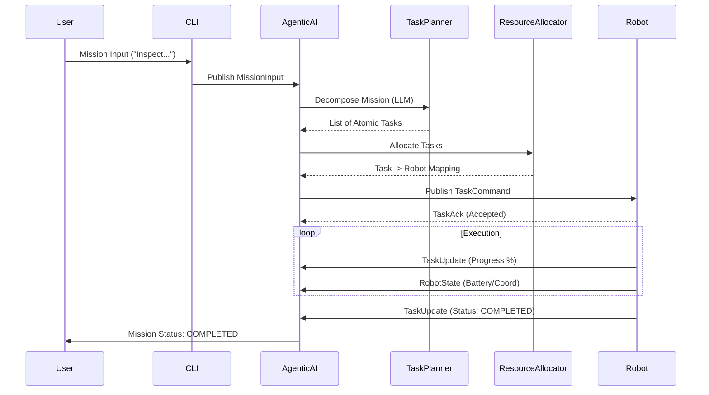

# Sutradhara Orchestrator: High-Level System Flow

This document provides a technical overview of how the Sutradhara Orchestrator handles a mission from user input to robot execution.

---

## 1. High-Level Workflow

The system is designed as an **agentic state machine** that uses Large Language Models (LLMs) for high-level reasoning and a custom Pub-Sub broker for real-time robotic communication.

### Step 1: Mission Reception
*   **Entry Point:** The user interacts with the system via the CLI (`cli.py`).
*   **Action:** When a natural language mission is entered (e.g., *"Inspect the north fence"*), the CLI wraps it into a `MissionInput` message.
*   **Communication:** This is published to the `mission_input` topic using the internal `broker`.

### Step 2: Mission Decomposition (The "Brain")
*   **Module:** `AgenticAI` & `TaskPlanner`.
*   **Action:** The `AgenticAI` triggers a planning cycle. The `TaskPlanner` sends the mission description, current world state, and available "Skills" (robot capabilities) to the LLM (e.g., Gemini 2.0).
*   **Output:** A list of atomic, executable `Task` objects that the system can track individually.

### Step 3: Resource Allocation
*   **Module:** `ResourceAllocator`.
*   **Action:** The system matches the newly created tasks to the best available robots. It scores robots based on:
    *   **Capability Match:** Does the robot support the task type?
    *   **Constraints:** Does the robot have the required sensors and sufficient battery?
    *   **Proximity:** How far is the robot from the task location?
*   **Output:** A mapping of `Task ID` to `Robot ID`.

### Step 4: Robot execution
*   **Module:** `SimulatedRobot` (UAV/UGV).
*   **Action:** Robots receive a `TaskCommand`. They acknowledge the command (`TaskAck`) and begin simulated execution.
*   **Feedback:** While working, robots publish continuous `TaskUpdate` messages (progress percentage) and `RobotState` messages (GPS coordinate, battery).

### Step 5: Monitoring & Self-Healing
*   **Module:** `AgenticAI`.
*   **Action:** The orchestrator monitors heartbeats and task progress.
    *   **Success:** When all tasks for a mission are marked as `COMPLETED`, the mission is finalized.
    *   **Failure/Timeout:** If a robot fails or goes offline, the `AgenticAI` detects the state change and automatically triggers a **re-planning cycle** to re-assign or modify the remaining tasks.

---

## 2. Key Modules & Directory Structure

To understand the codebase in detail, explore these core modules:

| Module | Absolute Path (from src root) | Description |
| :--- | :--- | :--- |
| **`cli.py`** | `sutradhara_orchestrator/cli.py` | Orchestrates the launch of the system and user input handling. |
| **`AgenticAI`** | `sutradhara_orchestrator/orchestrator/agentic_ai.py` | The central state machine managing mission lifecycles. |
| **`TaskPlanner`** | `sutradhara_orchestrator/orchestrator/task_planner.py` | Handles LLM interactions for mission decomposition and re-planning. |
| **`ResourceAllocator`** | `sutradhara_orchestrator/orchestrator/resource_allocator.py` | Logic for scoring and assigning tasks to robots. |
| **`SimulatedRobot`** | `sutradhara_orchestrator/simulation/robot.py` | Base class for UAVs and UGVs; implements the "actuator" logic. |
| **`WorldStateManager`**| `sutradhara_orchestrator/orchestrator/world_state_manager.py` | Aggregates robot heartbeats into a coherent real-time world view. |
| **`Broker`** | `sutradhara_orchestrator/pubsub/broker.py` | The message bus facilitating all inter-module communication. |

---

## 3. Communication Diagram

