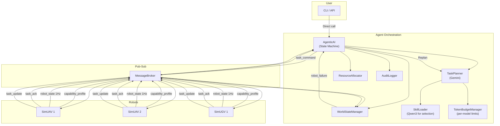
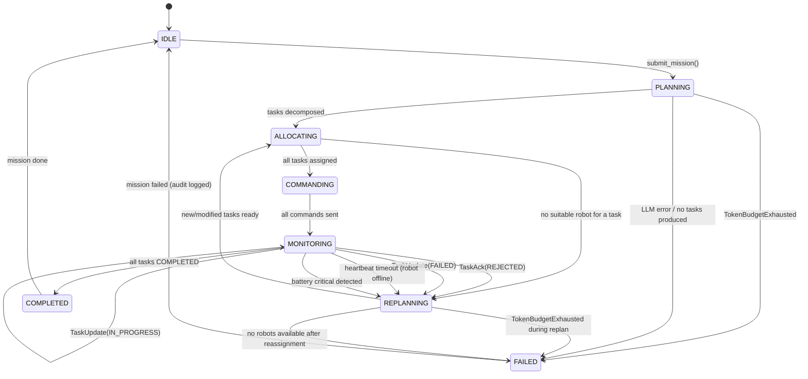

# Sutradhara Orchestrator — Implementation Plan (v4)

## Overview

Modular Agent Orchestration system, decoupled from ROS2, using dummy in-process pub-sub. Uses **LiteLLM** with a **multi-model strategy** (Gemini + local Qwen3 via Ollama) and **Anthropic-style Skills** for domain knowledge.

---

## Key Design Decisions

| Decision | Choice | Rationale |
|----------|--------|-----------|
| Transport | Dummy in-process pub-sub | Develop on macOS; swap for ROS2 later |
| Complex reasoning LLM | Gemini (`gemini/gemini-2.0-flash`) | Task decomposition, replanning |
| Lightweight LLM | Qwen3 via Ollama (`ollama/qwen3:1.7b`) | Skill selection, classification — reduces token cost |
| Skills format | **Anthropic SKILL.md** with YAML frontmatter | LLM reasons on `description` for selection — no keyword matching |
| Skill selection | **LLM-driven** (lightweight model reads skill descriptions, picks relevant ones) | More generalizable than keywords |
| Mission input | Direct API call to orchestrator | Pub-sub only for robot comms |
| Orchestration loop | Event-driven state machine with self-healing | Reactive; handles failures, replanning, budget exhaustion |
| Token budget | **Per-model budgets** within each mission | Separate limits for Gemini and Qwen3; each tracked independently |
| Audit trail | Structured JSON event log | Every decision: what changed, why, data, outcome |
| Environment | **uv** | Used for all Python operations (deps, env, testing, running) |

---

## Architecture



---

## Anthropic-Style Skills

Skills follow [Anthropic's best practices](https://platform.claude.com/docs/en/agents-and-tools/agent-skills/best-practices): YAML frontmatter with `name` and `description`, body under 500 lines, self-contained folders.

### Skill structure:

```
skills/
├── inspection/
│   └── SKILL.md
├── anomaly-triage/
│   └── SKILL.md
├── patrol/
│   └── SKILL.md
└── emergency-response/
    └── SKILL.md
```

### Example `inspection/SKILL.md`:

```yaml
---
name: infrastructure-inspection
description: >
  Decomposes infrastructure inspection missions into executable task graphs.
  Use when a mission involves surveying, scanning, or inspecting an area or
  set of assets for anomalies. Handles grid-based area coverage, sensor
  selection (THERMAL, RGB, LIDAR), and UAV/UGV assignment. Produces
  INSPECT tasks with appropriate waypoints and success criteria.
---
```

```markdown
# Infrastructure Inspection

## Decomposition Pattern
1. Define the inspection region from mission objectives
2. Grid the region into waypoint cells (spacing based on sensor FOV)
3. Create one INSPECT task per grid cell or per asset
4. Assign to robots with required sensors (THERMAL for heat, RGB for visual)
5. UAVs preferred for aerial survey; UGVs for ground-level detail
6. Set success criteria: IMAGE_SET_COLLECTED, THERMAL_CAPTURED

## Task Dependencies
- INSPECT tasks within a region can run in parallel
- If anomaly detected → spawn VERIFY task (use anomaly-triage skill)

## Robot Selection Hints
- Required sensors: at least one of [RGB, THERMAL]
- Prefer UAVs for speed; fall back to UGVs if unavailable
- Battery must exceed min_battery_pct for round-trip + return

## Output Format
Each task: task_type, target (POINT or REGION with points[]),
required_sensors, priority (0-100), success_criteria[]

## Examples
- "Inspect solar farm Block A" → grid Block A into cells,
  create INSPECT tasks for each cell with THERMAL sensor requirement
- "Survey warehouse perimeter" → generate perimeter waypoints,
  create INSPECT tasks with RGB sensor requirement
```

### LLM-Driven Skill Selection (no keyword matching):

```python
class SkillLoader:
    """Loads Anthropic-style skills and uses a lightweight LLM
    to select relevant skills based on mission description."""

    def __init__(self, skills_dir: str, selector_model: str = "ollama/qwen3:1.7b"):
        self.skills = self._load_all_skills(skills_dir)  # parse YAML frontmatter
        self.selector_model = selector_model

    def select_skills(self, mission_description: str,
                      token_budget: ModelTokenBudget) -> list[SkillContent]:
        """Uses lightweight LLM to reason over skill descriptions
        and select relevant ones. No keyword matching."""
        skill_summaries = [
            {"name": s.name, "description": s.description}
            for s in self.skills
        ]
        # Lightweight LLM call: "Given this mission and these skill
        # descriptions, return the names of relevant skills"
        response = litellm.completion(
            model=self.selector_model,
            messages=[
                {"role": "system", "content": "Select relevant skills..."},
                {"role": "user", "content": json.dumps({
                    "mission": mission_description,
                    "available_skills": skill_summaries
                })}
            ],
            response_format={"type": "json_object"}
        )
        token_budget.track(response)
        selected_names = self._parse_selection(response)
        return [s for s in self.skills if s.name in selected_names]
```

---

## Multi-Model Token Budget

Token budgets are tracked **per model** within each mission:

```python
@dataclass
class ModelTokenBudget:
    """Budget for a single model (e.g., Gemini or Qwen3)."""
    model_name: str
    max_tokens: int
    used_tokens: int = 0
    call_history: list = field(default_factory=list)

    def track(self, response) -> None:
        tokens = response.usage.prompt_tokens + response.usage.completion_tokens
        self.used_tokens += tokens
        self.call_history.append({"tokens": tokens, ...})
        if self.used_tokens >= self.max_tokens:
            raise TokenBudgetExhausted(
                f"{self.model_name} budget exhausted: {self.used_tokens}/{self.max_tokens}"
            )

class MissionTokenBudget:
    """Manages per-model budgets for a single mission."""
    def __init__(self, gemini_max: int = 50000, qwen_max: int = 10000):
        self.gemini = ModelTokenBudget("gemini", gemini_max)
        self.qwen = ModelTokenBudget("qwen3", qwen_max)

    def get_budget(self, model: str) -> ModelTokenBudget:
        if "gemini" in model: return self.gemini
        if "qwen" in model or "ollama" in model: return self.qwen
        raise ValueError(f"Unknown model: {model}")

    @property
    def total_used(self) -> int:
        return self.gemini.used_tokens + self.qwen.used_tokens
```

---

## Event-Driven State Machine (Self-Healing)



### Self-healing behaviors:

| Trigger | Detection | Response | Audit Event |
|---------|-----------|----------|-------------|
| Task rejected | [TaskAck(REJECTED)](file:///Users/satishjasthi/Documents/projects/Sutradhara-Orchestrator/src/sutradhara_orchestrator/sutradhara_orchestrator/messages/task_ack.py#3-40) | Reassign to next-best robot | `TASK_REJECTED` |
| Task failed | [TaskUpdate(FAILED)](file:///Users/satishjasthi/Documents/projects/Sutradhara-Orchestrator/src/sutradhara_orchestrator/sutradhara_orchestrator/messages/task_update.py#4-34) | Replan affected tasks (Gemini call) | `REPLAN_TRIGGERED` |
| Robot offline | No [RobotState](file:///Users/satishjasthi/Documents/projects/Sutradhara-Orchestrator/src/sutradhara_orchestrator/sutradhara_orchestrator/messages/robot_state.py#5-58) for N seconds | Reassign ALL tasks from dead robot | `ROBOT_FAILURE_DETECTED` |
| Battery critical | `RobotState.battery_pct < threshold` | Send RETURN_HOME, reassign | `BATTERY_CRITICAL` |
| New objective | `submit_mission()` again | Merge into plan, reallocate | `MISSION_MERGED` |
| Token budget exhausted | [TokenBudgetExhausted](file:///Users/satishjasthi/Documents/projects/Sutradhara-Orchestrator/src/sutradhara_orchestrator/sutradhara_orchestrator/orchestrator/token_budget.py#4-7) | Mission → FAILED, in-flight tasks continue | `TOKEN_BUDGET_EXHAUSTED` |

---

## Project Structure

```
src/sutradhara_orchestrator/
├── pyproject.toml
├── sutradhara_orchestrator/
│   ├── __init__.py
│   ├── cli.py
│   ├── pubsub/
│   │   ├── __init__.py
│   │   ├── broker.py
│   │   └── ros2_adapter.py             # Stub
│   ├── messages/
│   │   ├── __init__.py
│   │   ├── robot_state.py
│   │   ├── capability_profile.py
│   │   ├── task_command.py
│   │   ├── task_ack.py
│   │   ├── task_update.py
│   │   └── mission_input.py
│   ├── skills/                          # Anthropic-style skill folders
│   │   ├── __init__.py
│   │   ├── loader.py                    # LLM-driven skill selection
│   │   ├── inspection/SKILL.md
│   │   ├── anomaly-triage/SKILL.md
│   │   ├── patrol/SKILL.md
│   │   └── emergency-response/SKILL.md
│   ├── orchestrator/
│   │   ├── __init__.py
│   │   ├── agentic_ai.py               # Event-driven state machine
│   │   ├── task_planner.py             # Gemini-based decomposition
│   │   ├── resource_allocator.py
│   │   ├── world_state_manager.py
│   │   ├── token_budget.py             # Per-model token tracking
│   │   └── audit_logger.py
│   ├── models/
│   │   ├── __init__.py
│   │   ├── mission.py
│   │   ├── task.py
│   │   └── robot.py
│   └── simulation/
│       ├── __init__.py
│       ├── simulated_uav.py
│       └── simulated_ugv.py
└── tests/
    ├── test_broker.py
    ├── test_skill_loader.py
    ├── test_task_planner.py
    ├── test_resource_allocator.py
    ├── test_world_state_manager.py
    ├── test_token_budget.py
    ├── test_audit_logger.py
    └── test_end_to_end.py
```

---

## Implementation Phases

### Phase 1 — Foundation
- [ ] Initialize Python project using `uv` (`uv init`, `uv add litellm pyyaml pydantic pytest`)
- [ ] Implement [MessageBroker](file:///Users/satishjasthi/Documents/projects/Sutradhara-Orchestrator/src/sutradhara_orchestrator/sutradhara_orchestrator/pubsub/broker.py#7-59)
- [ ] Define all message dataclasses
- [ ] Implement data models (Mission, Task, Robot)
- [ ] Implement [AuditLogger](file:///Users/satishjasthi/Documents/projects/Sutradhara-Orchestrator/src/sutradhara_orchestrator/sutradhara_orchestrator/orchestrator/audit_logger.py#8-45)
- [ ] Implement [MissionTokenBudget](file:///Users/satishjasthi/Documents/projects/Sutradhara-Orchestrator/src/sutradhara_orchestrator/sutradhara_orchestrator/orchestrator/token_budget.py#48-73) + [ModelTokenBudget](file:///Users/satishjasthi/Documents/projects/Sutradhara-Orchestrator/src/sutradhara_orchestrator/sutradhara_orchestrator/orchestrator/token_budget.py#8-47) + [TokenBudgetExhausted](file:///Users/satishjasthi/Documents/projects/Sutradhara-Orchestrator/src/sutradhara_orchestrator/sutradhara_orchestrator/orchestrator/token_budget.py#4-7)

### Phase 2 — Skills & LLM Pipeline
- [ ] Write Anthropic-style SKILL.md files (4 skills)
- [ ] `SkillLoader` with LLM-driven selection (Qwen3 via Ollama)
- [ ] `TaskPlanner` with Gemini decomposition + per-model token tracking
- [ ] Tests: skill selection, decomposition, token exhaustion

### Phase 3 — World State & Simulated Robots
- [ ] `WorldStateManager` (discovery, tracking, heartbeat timeout)
- [ ] `SimulatedUAV` and `SimulatedUGV`
- [ ] Tests: robot discovery, state streaming, failure detection

### Phase 4 — Orchestrator Loop & CLI
- [ ] `ResourceAllocator` (scoring, capability filter)
- [ ] `AgenticAI` state machine (full event loop)
- [ ] CLI (launch, mission, audit, inject-fault)
- [ ] End-to-end test: mission → complete

### Phase 5 — Self-Healing
- [ ] Task rejection → reassign
- [ ] Task/robot failure → replan
- [ ] Battery critical → abort + reassign
- [ ] Token exhaustion → graceful FAILED state
- [ ] Mid-mission new objective → merge

---

## Verification

```bash
# All tests
uv run pytest tests/ -v

# Launch full stack
uv run python -m sutradhara_orchestrator.cli launch --uavs 2 --ugvs 1

# Submit mission (direct call to orchestrator, NOT via pub-sub)
uv run python -m sutradhara_orchestrator.cli mission "Inspect solar farm Block A for thermal anomalies"

# View audit trail
uv run python -m sutradhara_orchestrator.cli audit --mission-id mission_001

# Inject fault for testing self-healing
uv run python -m sutradhara_orchestrator.cli inject-fault --robot-id uav_1 --fault GPS_LOST
```
